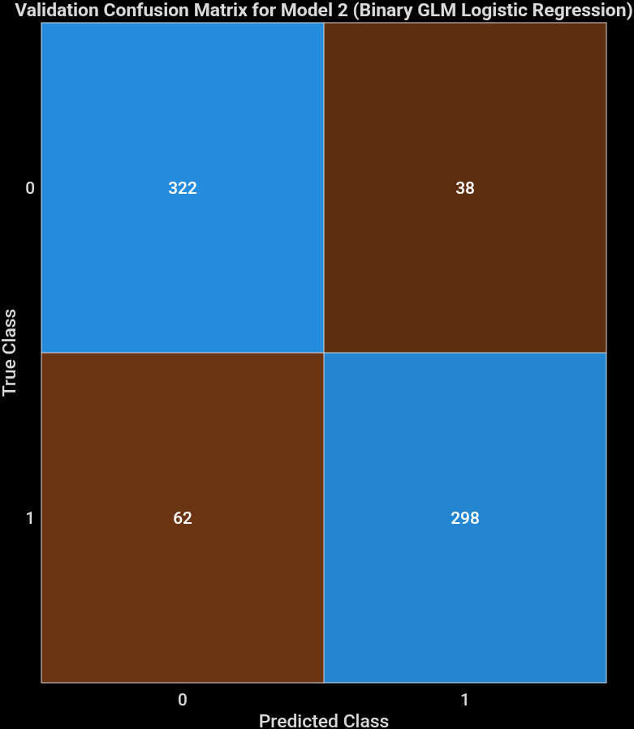
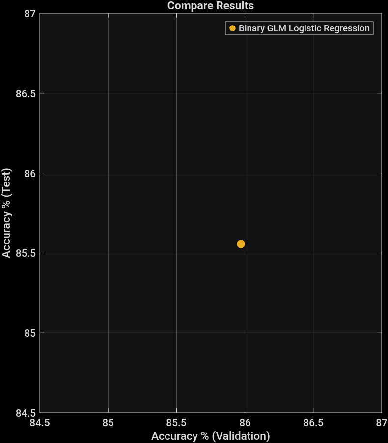

# My-work
# Raisin Dataset Analysis
## Dataset Overview
- **Training Observations:** 819  
- **Test Observations:** 180  
- **Predictors (Features):** 7  
  - Area  
  - MajorAxisLength  
  - MinorAxisLength  
  - Eccentricity  
  - ConvexArea  
  - Extent  
  - Perimeter  
- **Response:** `ClassBool` (2 classes: 0 and 1)  
- **Validation Method:** 5-fold cross-validation  
---

## Favorite Model

| Metric | Value |
|--------|-------|
| Model Number | 2 |
| Model Type | Binary GLM (Logistic Regression) |
| Validation Accuracy | 86.11% |
| Validation Total Cost | 100 |
| Test Accuracy | 85.56% |
| Test Total Cost | 26 |

---

## Accuracy Plots

### Validation Accuracy

### Test Accuracy

---

## Key Insights
1. **High Accuracy:** Both validation and test accuracies are above 85%, indicating good model generalization.  
2. **Cost Reduction:** Total cost decreased from 100 (validation) to 26 (test), suggesting efficient error handling.  
3. **Model Choice:** Logistic Regression is suitable for this binary classification problem with numeric predictors.

---

## Next Steps
- Explore feature importance to identify which predictors contribute most to the classification.  
- Test additional models (e.g., Decision Trees, Random Forests) for possible accuracy improvement.  
- Consider visualizing ROC curves or confusion matrices for better evaluation.

---

*Analysis conducted on Raisin Dataset with 819 training and 180 test observations.*
